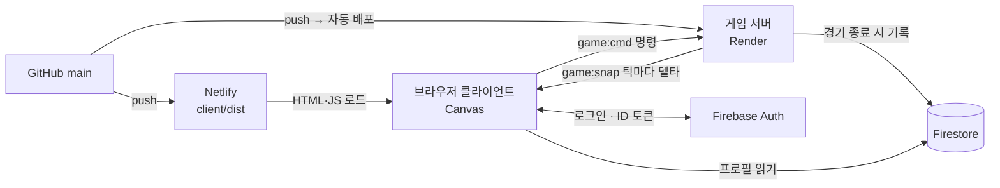

# 룬 & 크라운 — 기술 설계서 v0.1

> 클라이언트는 명령만 보내고, 서버가 세계를 계산하며, Firebase는 결과만 기억한다.

- 문서 단계: 2단계 (기술 스택·아키텍처)
- 작성일: 2026-09-15
- 기준 기획: [GAME_DESIGN.md](GAME_DESIGN.md) v0.2

---

## 1. 핵심 결정

| 결정 | 선택 | 이유 |
|---|---|---|
| 동기화 모델 | **서버 권위 시뮬레이션** + 스냅샷 보간 | 클라이언트는 명령만 보내고 결과는 서버가 계산한다. 자원·전투 조작이 불가능하고, 락스텝(결정론 동기화)보다 재접속과 디버깅이 쉽다. |
| 시뮬레이션 틱 | 20Hz (50ms) 고정 타임스텝, 매 틱 델타 스냅샷 | RTS에 충분한 반응성. 1v1 규모에서 대역폭 부담이 작다. |
| 실시간 통신 | Socket.IO 4 (WebSocket) | 방(room) 브로드캐스트, 자동 재연결, 핸드셰이크 인증을 기본 제공한다. |
| 공용 코드 | `shared/` 워크스페이스 패키지 | 유닛 수치·피해 배율표·프로토콜을 서버와 클라이언트가 같은 파일로 쓴다. 수치가 어긋날 일이 없다. |
| 클라이언트 | Vite + Canvas 2D, HUD는 DOM | 게임 엔진 없이 가볍게. Vite가 모듈 번들링과 환경 변수(`VITE_*`)를 해결한다. 버튼·패널은 Canvas보다 DOM이 만들기 쉽다. |
| Firebase | Auth(익명 → Google) + Firestore(프로필·전적) | 실시간 게임 상태는 Firestore에 쓰지 않는다. 지연이 크고 쓰기마다 비용이 든다. |
| 호스팅 | 클라이언트 Netlify · 게임 서버 Render · 데이터 Firebase | Netlify는 정적 파일과 서버리스 함수만 돌려서 WebSocket 서버를 상주시킬 수 없다. |
| 런타임 | Node.js 24 LTS, ES 모듈 | 서버·공용 코드·브라우저가 같은 `import` 문법을 쓴다. `node --watch`, `node --test` 내장. |

---

## 2. 시스템 구성



| 구성 요소 | 호스팅 | 책임 |
|---|---|---|
| 클라이언트 | Netlify | 렌더링, 입력, 보간, UI. 게임 규칙 판정은 하지 않는다 |
| 게임 서버 | Render (싱가포르 리전) | 로비, 경기 방, 시뮬레이션, 길찾기, 스냅샷, 토큰 검증 |
| Firebase Auth | Firebase | 익명·Google 로그인, ID 토큰 발급 |
| Firestore | Firebase (`asia-northeast3` 서울) | 유저 프로필, 전적, 경기 결과 |

- Render 무료 플랜은 요청이 없으면 잠들어 첫 연결이 느릴 수 있다. 개발·테스트는 무료로, 공개 테스트부터는 상시 실행 플랜을 쓴다.
- Firestore 위치는 한 번 정하면 바꿀 수 없으니 처음 만들 때 서울 리전을 고른다.

---

## 3. 폴더 구조

```
rune-and-crown/
├─ package.json              # npm 워크스페이스 (shared, server, client)
├─ netlify.toml              # 클라이언트 빌드·배포 설정
├─ firebase.json             # Firestore 규칙 배포 설정
├─ firestore.rules
├─ .gitignore                # node_modules, dist, .env, 서비스 계정 키
├─ docs/
│  ├─ GAME_DESIGN.md
│  └─ ARCHITECTURE.md
│
├─ shared/                   # 서버·클라이언트 공용. DOM·Node API를 쓰지 않는 순수 JS
│  ├─ package.json           # name: @rune/shared
│  └─ src/
│     ├─ constants.js        # TICK_MS, TILE_SIZE, MAP_SIZE, 인구 상한
│     ├─ protocol.js         # 소켓 이벤트 이름, 명령 타입, 스냅샷 비트마스크
│     ├─ data/
│     │  ├─ units.js         # 유닛 능력치 (GAME_DESIGN 3장)
│     │  ├─ buildings.js     # 건물 능력치 (5장)
│     │  ├─ damage.js        # 피해 배율표, 피해 공식
│     │  └─ market.js        # 시장 시세 규칙
│     └─ map/
│        ├─ grid.js          # 타일 ↔ 월드 좌표, 건물 풋프린트
│        └─ maps/duel01.js   # 1v1 맵: 지형, 금광, 숲, 마나 샘
│
├─ server/
│  ├─ package.json
│  ├─ .env.example
│  └─ src/
│     ├─ index.js            # HTTP + Socket.IO 시작, /health
│     ├─ config.js           # 환경 변수 읽기
│     ├─ firebase.js         # Admin SDK 초기화
│     ├─ net/
│     │  ├─ auth.js          # 핸드셰이크 ID 토큰 검증
│     │  ├─ lobby.js         # 방 목록, 입장, 준비
│     │  ├─ rateLimit.js     # 명령 토큰 버킷
│     │  └─ validate.js      # 명령 페이로드 검사
│     ├─ game/
│     │  ├─ Room.js          # 경기 한 판. 틱 루프, 플레이어 슬롯, 재접속
│     │  ├─ World.js         # 엔티티 저장소, 플레이어 자원, 공간 해시
│     │  ├─ Simulation.js    # 틱마다 시스템을 정해진 순서로 실행
│     │  ├─ entities.js      # createUnit, createBuilding
│     │  ├─ systems/
│     │  │  ├─ commands.js
│     │  │  ├─ movement.js
│     │  │  ├─ gathering.js
│     │  │  ├─ construction.js
│     │  │  ├─ production.js
│     │  │  ├─ combat.js
│     │  │  ├─ economy.js    # 마나 생산, 시장 시세 회복, 인구
│     │  │  └─ victory.js
│     │  ├─ pathfinding/
│     │  │  ├─ NavGrid.js    # 통행 가능 칸. 건물·나무·성문 반영
│     │  │  ├─ BinaryHeap.js
│     │  │  ├─ astar.js
│     │  │  ├─ smooth.js     # 시야선 검사로 경로 다듬기
│     │  │  └─ PathQueue.js  # 틱당 계산 예산
│     │  └─ sync/
│     │     ├─ snapshot.js   # 플레이어별 델타 스냅샷
│     │     └─ visibility.js # (확장) 전장의 안개
│     └─ persistence/
│        └─ matches.js       # 경기 결과 Firestore 기록
│
└─ client/
   ├─ package.json
   ├─ vite.config.js
   ├─ index.html
   ├─ .env.example
   ├─ public/assets/         # 스프라이트, 사운드
   └─ src/
      ├─ main.js             # 로그인 → 로비 → 게임
      ├─ firebase.js         # 클라이언트 SDK, 익명 로그인
      ├─ net/
      │  ├─ socket.js        # 연결, 토큰 전달, 재접속
      │  └─ commands.js      # 명령 전송, seq 관리
      ├─ world/
      │  ├─ ClientWorld.js   # 스냅샷 적용, 엔티티 보관
      │  └─ interpolation.js # 서버 틱 추정, 위치 보간
      ├─ render/
      │  ├─ Renderer.js      # requestAnimationFrame 루프, 그리기 순서
      │  ├─ Camera.js        # 스크롤, 줌, 좌표 변환
      │  ├─ terrain.js       # 지형 청크를 오프스크린 캔버스에 캐시
      │  ├─ sprites.js
      │  └─ minimap.js
      ├─ input/
      │  ├─ Input.js         # 마우스·키보드 상태
      │  ├─ selection.js     # 드래그 박스 선택
      │  └─ orders.js        # 우클릭 대상 판정 → 명령
      └─ ui/                 # HUD는 DOM으로 Canvas 위에 겹친다
         ├─ hud.js
         ├─ commandCard.js
         └─ lobby.js
```

루트 `package.json`

```json
{
  "name": "rune-and-crown",
  "private": true,
  "type": "module",
  "workspaces": ["shared", "server", "client"],
  "scripts": {
    "dev": "concurrently -n server,client \"npm run dev -w server\" \"npm run dev -w client\"",
    "build": "npm run build -w client",
    "test": "node --test"
  },
  "engines": { "node": ">=24" }
}
```

공용 코드는 워크스페이스 패키지로 가져온다: `import { UNITS } from '@rune/shared/data/units.js'`

---

## 4. 서버 게임 루프

### 틱 순서 (50ms마다)

0. **시야** — 팀별 시야 갱신 (전장의 안개. 명령 검증·표적 찾기·스냅샷이 모두 이 시야를 쓴다)
1. **명령 적용** — 지난 틱 이후 받은 명령을 검증해 유닛에 넣는다
2. **능력·상태** — 오라, 기절·둔화, 영창, 뿌리내리기 전환, 탑승, 부활 (이동·전투보다 먼저라 이번 틱에 바로 반영된다)
3. **이동** — 경로 요청을 틱당 예산(24회·8ms)만큼 계산하고 웨이포인트를 따라 이동
4. **밀어내기** — 겹친 유닛을 서로 떼어 놓는다
5. **전투** — 적 찾기, 사거리까지 쫓기, 공격 간격, 피해 적용
6. **정리** — 체력이 다한 유닛·건물 제거 (궁극 유닛은 부활 예약·탑승 유닛 내리기)
7. **채집·건설·생산** — 생산은 건물과 뿌리내린 아르카논
8. **경제** — 마나 생산, 시대 발전, 시장 시세 회복, 인구 계산
9. **승리 판정** — 왕관 몰락 카운트다운, 전멸, 항복·이탈
10. **스냅샷** — 팀별 델타(보이는 것만) + 플레이어별 자원·생산 정보 전송

### 고정 타임스텝

```js
const TICK_MS = 50;
const MAX_CATCH_UP = 5;
let next = performance.now();

function loop() {
  let steps = 0;
  while (performance.now() >= next && steps < MAX_CATCH_UP) {
    room.step();
    next += TICK_MS;
    steps++;
  }
  if (steps === MAX_CATCH_UP) next = performance.now(); // 너무 밀리면 따라잡기를 포기
  setTimeout(loop, Math.max(0, next - performance.now()));
}
```

### 엔티티

MVP는 `Map<id, entity>`에 평범한 객체를 담는다.

```js
{
  id, owner, type, x, y, hp,
  state,          // 7장 유닛 상태
  targetId,
  orders: [],     // Shift 예약 명령
  path: null,     // 웨이포인트 배열
  cooldown: 0,
  carry: null,    // { kind: 'gold', amount: 10 }
  dirty: 0        // 이번 틱에 바뀐 필드 비트마스크
}
```

---

## 5. 실시간 동기화

### 명령 한 번의 흐름

1. 우클릭하면 클라이언트가 대상을 판정한다: 적이면 공격, 자원이면 채집, 땅이면 이동. `game:cmd`를 보내고 이동 마커·효과음은 서버를 기다리지 않고 바로 보여준다.
2. 서버는 다음 틱에 명령을 검증하고 적용한다.
3. 서버는 매 틱 플레이어별 델타 스냅샷 `game:snap`을 보낸다.
4. 클라이언트는 스냅샷을 버퍼에 쌓고 **추정 서버 시간 − 100ms** 시점을 그린다. 이미 받은 두 스냅샷 사이 위치를 보간해 20Hz 데이터를 60fps로 부드럽게 보여준다.
5. 체감 지연 ≈ 왕복 지연 + 최대 50ms(틱 대기) + 100ms(보간). RTS는 유닛을 간접 조작하므로 클라이언트 예측은 쓰지 않는다.

### 소켓 이벤트 (`shared/src/protocol.js`)

| 방향 | 이벤트 | 내용 |
|---|---|---|
| C→S | `lobby:list` · `lobby:create` · `lobby:join` · `lobby:leave` · `lobby:ready` | 방 목록, 만들기, 입장, 나가기, 준비 (모두 ack로 응답) |
| C→S | `game:cmd` | `{ seq, type, unitIds, target, queue }` |
| C→S | `net:ping` · `game:surrender` | 지연 측정, 항복 |
| S→C | `lobby:update` | 방 목록 |
| S→C | `lobby:room` | 내가 들어간 방의 참가자·준비 상태 (나오면 `null`) |
| S→C | `game:countdown` | 시작 카운트다운 (`seconds`가 0이면 취소) |
| S→C | `session:replaced` | 같은 계정이 다른 곳에서 접속해 이 연결을 끊음 |
| S→C | `game:start` | 맵, 플레이어, 전체 상태 |
| S→C | `game:snap` | 틱 델타 스냅샷 |
| S→C | `game:reject` | 거부된 명령 `{ seq, reason }` → "자원이 부족합니다" 등 |
| S→C | `game:end` | 승자, 승리 유형, 통계 |

명령 타입: `move` `attackMove` `attack` `stop` `gather` `returnCargo` `place` `construct` `cancelBuild` `train` `cancelTrain` `setRally` `ageUp` `cancelAgeUp` `trade` `toggleAbility` `useAbility` `board` `takeOath` `sendResources` `surrender`

### 스냅샷 포맷 (`shared/src/snapshot.js`, `server/src/game/sync/snapshot.js`)

틱마다 **바뀐 것만** 보낸다. 서버는 지난 틱에 보낸 인코딩을 들고 있다가 이번 틱 인코딩과 비교해 마스크를 만든다.
(엔티티마다 dirty 비트를 다는 대신 인코딩을 비교한다 — 시스템 코드가 단순해지고 나가는 결과는 같다.)

```js
{
  t: 1234,                     // 서버 틱
  full: true,                  // 전체 상태일 때만 (첫 입장·재접속)
  players: [[slot, 시대, 왕관 몰락까지 남은 초, 패배 0|1]],
  addU: [[id, 종류, 주인, x16, y16, hp, 상태, 운반종류, 운반량, 플래그]],
  updU: [[id, 마스크, ...바뀐 값]],   // 마스크: 움직임 64(지난 위치와의 차이, 1/16타일) · 체력 2 · 상태 4 · 운반 8 · 플래그 16 · 추가 값 32
  addB: [[id, 종류, 주인, x, y, hp, 진행도, 플래그]],
  updB: [[id, 마스크, ...바뀐 값]],   // 마스크: 체력 1 · 진행도 2 · 플래그 4
  del:  [id],                  // 사라진 유닛·건물
  mines:[[금광id, 남은 양]],     // 0이면 다 캤다
  ev:   [[GAME_EVENT.ATTACK, 공격자, 대상], [GAME_EVENT.UNIT_DIED, id]],
  me:   [금, 목재, 마나, 인구, 상한, 시대, ...],  // 내 것만, 바뀐 틱에만
  own:  { q: 생산 대기열, r: 집결지 }            // 내 건물만, 바뀐 틱에만
  allies: [[slot, 금, 목재, 마나]]                // 팀원 자원 (팀전), 0.5초마다 바뀌었을 때만
}
```

- **팀마다 따로 만든다** (전장의 안개, 5-7장). 같은 팀은 같은 팀 델타를 받고 `me`·`own`·`allies`만 사람마다 다르다.
- **빈 항목은 키째로 뺀다.** 아무도 움직이지 않는 틱에는 `{ t }`만 나간다.
- 좌표는 1/16타일 정수 (96타일 × 16 = 1536). 소수점 없이 짧다.
- 공격 모션, 투사체, 사망 효과는 상태가 아니라 **이벤트**로 보낸다.
- 상대의 자원과 생산 대기열은 보내지 않는다. `me`·`own`·`allies`는 플레이어별 개인화 단계에서만 얹는다.
- 팀에게만 가는 이벤트(`RESOURCES_SENT`)는 공용 델타에서 빼 두었다가 그 팀의 스냅샷에만 얹는다.
- **위치는 움직인 만큼**(`MOVE`)만 보낸다. 한 틱 이동은 1/16타일 단위로 몇 칸이라 숫자가 짧고 반복이 많아 압축이 잘 된다.
  클라이언트는 좌표를 1/16 정수로 되돌려 더하므로 오차가 쌓이지 않는다. 절대 위치(`POS` 1)는 버전 1 리플레이를 읽으려고 남겼다.
  (Socket.IO는 순서를 지키고 잃지 않는다. 끊겼다 돌아오면 전체 스냅샷으로 다시 맞춘다)
- 1KB 이상 메시지는 `perMessageDeflate`로 압축한다 (문맥 유지, 기본 압축 수준 — 수준 1·3은 CPU가 조금 줄지만 크기가 30~60% 커졌다).
- 실측(2인, 유닛 8기 채취 중): 평균 **87B/틱**, 최대 476B, 같은 상황의 전체 스냅샷은 513B.
- 실측(3대3 대규모 전투, 유닛 320기, 5-8장 벤치마크): 1인당 원본 **2.1KB/틱**, 압축 뒤 약 **0.3KB/틱 ≈ 47kbps**.

### 클라이언트 보간 (`client/src/world/ClientWorld.js`)

화면은 **서버보다 2틱(=100ms) 뒤**를 그린다. 그만큼 늦게 보는 대신, 그릴 시점의 앞뒤 스냅샷이 이미 도착해 있어
두 위치를 잇기만 하면 된다. 위치를 쫓아가는 방식과 달리 속도가 일정해 보이고, 스냅샷 하나를 놓쳐도 튀지 않는다.

- 유닛마다 위치 표본 링 버퍼(최대 6개)를 둔다. 표본은 **위치가 바뀐 틱에만** 쌓인다(가만히 선 유닛은 공짜).
- `renderTick`은 프레임 시간만큼 흐르고, 목표(`마지막 서버 틱 − 2`)와 어긋난 만큼 ±20% 안에서 빠르거나 느리게 간다.
- 8틱 넘게 벌어지면(탭 비활성, 긴 끊김) 보정하지 않고 바로 목표로 건너뛴다.
- 표본이 하나뿐이거나 그릴 시점이 마지막 표본보다 뒤면 마지막 위치를 유지한다 — 서버 위치를 앞질러 예측하지 않는다.
  (예측은 되돌릴 때 유닛이 뒤로 미끄러져 보여서, 이 규모에서는 손해가 크다.)

### 재접속 (`server/src/net/lobby.js`)

- Firebase uid로 플레이어를 식별한다. 경기 중에 끊기면 슬롯을 **60초**(`RECONNECT_GRACE_SEC`) 지킨다.
- 끊긴 사이에도 경기는 계속 돈다. 그 플레이어에게는 스냅샷을 보내지 않고, 명령은 오지 않으니 유닛은 하던 일을 계속한다.
- 방에 남은 상대에게는 `connected: false`가 브로드캐스트되어 "상대의 연결이 끊겼습니다"가 뜬다.
- 같은 uid로 다시 붙으면 `game:resume` → 다음 틱에 `full: true` 스냅샷을 받아 처음부터 다시 맞춘다.
- 유예 시간이 지나면 패배(`VICTORY_REASON.LEFT`) 처리하고 방에서 뺀다. 상대가 이긴다.
- 대기실에서 끊긴 경우는 유예 없이 바로 방에서 나간다.

---

### 리플레이 (`client/src/game/replayFile.js`, `ReplayPlayer.js`, `ReplayView.js`)

서버에 저장하지 않고 **클라이언트가 받은 스냅샷을 그대로 녹화**한다. 경기가 끝나면 결과 화면에서 `.rcr` 파일로 내려받고,
첫 화면이나 로비에서 열어 본다.

- **시뮬레이션을 다시 돌리지 않는다.** 받았던 델타를 다시 적용할 뿐이라 규칙·밸런스가 바뀌어도 옛 리플레이가 깨지지 않는다.
  대신 녹화한 사람의 시점이다 (내 자원·생산 대기열만 있다).
- 파일: `{ format: 'rune-replay', version, mapId, mySlot, players[{nickname, slot}], result, snapshots[] }`를
  (버전 2: 위치를 움직인 만큼으로 담는다. 버전 3: 맵이 바다·강·다리로 바뀌어 그 전 파일은 열지 않는다)
  gzip(`CompressionStream`)으로 줄인다. uid는 담지 않는다. 실측 6초 경기 기준 약 1/8.
- **되감기**는 월드를 비우고(`reset`) 처음부터 다시 적용한다. 스냅샷이 작아 20분 경기도 수십 ms다.
  탐색하는 동안은 `world.quiet`로 효과·알림을 만들지 않고, 끝나면 지형 캐시를 통째로 다시 그린다.
- **재생 시계**는 서버 시계 대신 `ReplayPlayer.tick`(배속 0.5~8×)이고, `interpolateAt(tick − 1)`로 두 스냅샷 사이를 잇는다.
- 재접속해도 같은 경기의 녹화는 이어서 쌓는다. 중간에 끼는 `full` 스냅샷이 상태를 다시 맞춘다.
- `full` 스냅샷에는 이미 베인 나무(`felled`)도 싣는다 — 재접속 화면과 리플레이 되감기에서 나무가 되살아나지 않게.

---

### 입력: 마우스와 터치 (`client/src/input/Input.js`, `TouchControls.js`)

마우스·키보드는 `Input`이, 손가락은 `TouchControls`가 맡는다 (`pointerType`으로 나눈다). 둘 다 같은 GameView 동작을 부른다.

| 제스처 | 동작 |
|---|---|
| 탭 | 내 것은 선택, 병력·생산 건물을 고른 채면 그 자리에 명령 (마우스 왼쪽·오른쪽 클릭을 하나로) |
| 두 번 탭 | 같은 종류 모두 선택 |
| 한 손가락 끌기 | 화면 이동 |
| 길게(380ms) 누른 채 끌기 | 사각형 선택 |
| 두 손가락 | 확대 단계(1.28배마다 한 단계) + 화면 이동. 지형 청크가 정수 픽셀에 떨어지도록 연속 확대 대신 단계로 |
| 건물 배치 중 끌기 | 미리보기가 손가락 48px 위를 따라오고, 떼면 짓는다 |

- 손가락 화면 판정은 `(pointer: coarse)` 또는 `(hover: none)`. 이때 HUD에 `is-touch`를 붙여 단축키 글자를 숨기고 버튼을 키우며,
  Esc·드래그 선택을 대신할 **취소 / 병력 전체 / 쉬는 농노** 버튼을 띄운다.
- 레이아웃: `max-height: 520px`(가로 휴대폰)는 명령 카드를 오른쪽에 세로로, `max-width: 600px`(세로 휴대폰)는 아래 시트로.
  노치는 `env(safe-area-inset-*)`로 피한다.

---

## 5-3. 팀전과 방 (`server/src/net/lobby.js`, `shared/src/map/`)

- **슬롯과 팀**: 맵의 시작 위치에 번호(슬롯)를 붙이고 **짝수 슬롯 = 팀 0, 홀수 슬롯 = 팀 1**로 고정한다.
  대기실에서는 팀만 고르고, 경기를 시작할 때 팀 안에서 먼저 들어온 순서대로 슬롯을 정한다.
  유닛·건물의 `owner`는 여전히 슬롯이다 (명령·생산·자원은 플레이어 단위).
- **적 판정은 팀으로**: `world.areEnemies(a, b)` — 표적 선정, 범위·연쇄 피해, 능력 대상, 공격 명령 검증이 모두 이것을 쓴다.
  오라는 같은 팀에, 탑승·생산·자원 반납은 자기 것에만.
- **승리**: 한 팀의 모든 플레이어가 패배하면 끝. 패배한 플레이어의 유닛·건물은 hp 0으로 무너뜨린다.
  결과는 `{ winnerTeam, reason, tick }` — reason은 마지막으로 진 플레이어의 이유다.
- **방**: `{ mode: '1v1'|'2v2'|'3v3', mapId, players[{ uid, nickname, team, slot, ready, connected }] }`.
  방장만 방식·맵을 바꾸고(모드에 맞는 맵만), 바꾸면 모두의 준비가 풀린다. 팀 인원이 모두 차고 모두 준비하면 카운트다운.
  들어오는 사람은 인원이 적은 팀으로 간다.
- **지형** (`shared/src/map/grid.js`): 풀밭·흙·물·바위·나무·**다리**(5). 번호는 스냅샷·리플레이에 실리므로 새 지형은 뒤에 붙인다.
  걷는 유닛은 물·바위·나무에 막히고 다리는 건넌다(`isBlockingTerrain`). 배는 물과 다리 밑으로 다닌다(`isNavigableWater`).
  건물은 풀밭·흙에만(`isBuildableTerrain`). `seaWater(map)`은 가장자리 바다와 이어진 물 칸을 맵마다 한 번 계산해 둔다.
- **맵 만들기** (`builder.js`): 숲·바위 → `sea()` 바다 테두리 → `river()` 스플라인 강 → `bridge()` 물 위에만 다리 →
  `finish()` 공터·길목. 길목을 낼 때 숲·바위만 치우고 물은 건드리지 않는다 — 강은 반드시 다리로 건너게 설계한다.
  맵 테스트가 점대칭·시설 위치·걸어서 닿는지·가장자리 바다·갇힌 물이 없는지·본진 옆 조선소 자리를 모두 확인한다.
- **자원 보내기** (`sendResources { to, resource, amount }`): 같은 팀·안 쓰러진 두 사람 사이에서만,
  가진 만큼만(내림한 값으로 비교). 받는 쪽에는 `TRIBUTE.fee`(10%)를 뗀 내림 값이 들어간다 (`shared/src/data/economy.js`).

---

## 5-4. 랭킹전 (`server/src/net/matchmaking.js`, `shared/src/rules/rating.js`)

- **대기열**은 방식(1대1·2대2·3대3)마다 따로다. 1초마다 레이팅 순으로 늘어놓고 연속한 (팀 크기 × 2)명씩 보며,
  그 묶음에서 가장 오래 기다린 사람의 허용 차이(바로 ±150, 10초마다 +50, 최대 1000) 안이면 묶는다.
  가장 오래 기다린 사람이 들어간 묶음을 먼저 잡는다.
- **팀 나누기**: 레이팅 합의 차이가 가장 작은 조합 (4명 3가지, 6명 10가지를 모두 본다).
- 맵은 그 방식의 맵 중 하나를 고른다. 로비에 **랭킹전 방**을 열어(목록에 안 보이고 끼어들 수 없다) 준비 없이 바로 카운트다운한다.
  시작 전에 한 명이라도 나가면 방이 깨지고, 남은 사람은 대기열 앞쪽(60초 기다린 것으로)으로 돌아간다.
  끝나면 재대결 없이 방이 닫힌다.
- **레이팅**: 팀 평균 Elo. `기대 승률 = 1 / (1 + 10^((상대 팀 평균 − 우리 팀 평균) / 400))`,
  변화 = K × (결과 − 기대 승률). K는 그 방식의 랭킹전 10판까지 48, 이후 32. 바닥 100. 무승부는 그대로.
  이탈은 패배로 처리되므로 레이팅도 잃는다.
- 경기가 끝나면 저장소에서 레이팅을 다시 읽어 계산하고(`applyRatings`, Firestore는 배치 한 번),
  참가자에게 `ranked:result`와 갱신된 `session:profile`을 보낸다.
- **순위표**: 방식별 상위 50명을 30초 캐시한다 (레이팅이 바뀌면 바로 비운다). 내 순위는 집계 쿼리(`count()`)로
  "나보다 높은 사람 수 + 1"을 구해 문서를 읽지 않는다.

---

## 5-5. 채팅 (`server/src/net/chat.js`, `shared/src/rules/chat.js`)

- 방(대기실·경기) 안에서만. **전체**는 방의 모두에게, **팀**은 보낸 사람과 같은 팀에게만 보낸다
  (방 채널로 뿌리지 않고 플레이어마다 골라 보낸다).
- 서버가 거른다: 제어 문자·제로폭 문자를 공백으로 바꾸고 연속 공백을 하나로, 150자, **5초에 5개**,
  욕설 가리기(글자 사이에 공백·기호를 끼워도 잡는다, 목록은 `chat.js`에서 늘린다).
- 방마다 최근 50개를 기억해, 들어오거나 다시 접속한 사람에게 **볼 수 있는 것만**(`chat:history`) 보낸다.
  방이 닫히면 지운다. 들어옴·나감·연결 끊김·다시 접속·경기 시작은 안내 메시지(`from: null`)로 남긴다.
- 로비는 `EventEmitter`라 매칭과 채팅이 같은 방 이벤트(`playerJoined`, `playerLeft`, `roomClosed` …)를 함께 듣는다.
- 화면: 대기실은 늘 보이는 채팅 칸, 게임 화면은 미니맵 위에 떠서 10초 뒤 흐려지고
  **Enter로 입력 칸을 연다** (Enter 보내기, Esc 닫기, Tab 전체·팀). 모바일은 '채팅' 버튼.

---

## 5-6. 튜토리얼 (`client/src/tutorial/`)

- **서버 없이 브라우저에서 돈다.** 게임 서버의 시뮬레이션 코드(`server/src/game`)는 Node 전용 API를 쓰지 않아
  그대로 브라우저에서 돌릴 수 있다. `LocalMatch`가 틱을 돌리고 소켓 흉내(`on`·`off`·`emit`)를 내서
  실제 경기 화면(GameView)을 한 줄도 고치지 않고 쓴다. 로그인 없이 첫 화면에서도 할 수 있다.
- 시뮬레이션 코드는 튜토리얼을 열 때만 받는다 (동적 import, 약 18KB gzip).
- 단계(`steps.js`)마다 `start(ctx)`로 자원·적을 준비하고 `done(ctx)`를 틱마다 확인한다.
  ctx에는 서버 월드와 화면 상태(카메라·선택)가 있어 "화면을 움직였는가", "금광에 채집 명령을 냈는가"처럼
  플레이어가 실제로 한 일을 본다. 짓고 뽑는 동안은 4배속으로 감는다.
- 단계: 화면 이동 → 선택 → 금 캐기 → 여러 유닛 선택 → 나무 베기 → 농가 → (빨리 감기) → 병영과 창병 →
  전투(창병 대 척후 기병, 상성 체험) → 시대와 맹세 안내. 마치면 `localStorage`에 표시해 로비에서 알려 준다.
- 테스트가 모든 단계를 플레이어 명령만으로 끝까지 진행해 본다 (단계를 바꾸면 이 테스트가 막힌 단계를 알려 준다).

---

## 5-7. 전장의 안개 (`shared/src/rules/vision.js`, `server/src/game/systems/vision.js`, `server/src/game/sync/snapshot.js`)

- **시야 격자** (`VisionGrid`): 팀마다 칸별 "이 칸을 보는 시야 수"(Uint16)를 센다. 시야(유닛·건물)는 칸이나 반지름이
  바뀔 때만 옛 원을 빼고 새 원을 더한다. 원은 반지름별로 줄마다 가로 반폭을 캐시해 두고 칠한다.
  가만히 선 병력과 건물은 틱마다 비용이 거의 없고, 움직이는 유닛도 칸을 넘을 때(약 0.4초에 한 번)만 칠한다.
  서버와 클라이언트가 같은 코드를 쓴다 (클라이언트는 우리 팀만 세고, 한 번 본 칸 `explored`도 기억한다).
- **틱 맨 앞**에서 갱신한다. 명령 검증(안개 속 적 유닛은 `attack` 거부), 표적 찾기(보이는 적만), 스냅샷이 같은 시야를 쓴다.
  `knownBuildings[team]`에 한 번 본 적 건물을 모아 두어 안개 속 건물에도 공격 명령을 받는다.
- **공격자 드러내기**: 피해를 주면 `revealUntil[맞은 팀] = 틱 + 2초`. 그동안 공격자 자리에 반지름 1의 시야를 그 팀에게 놓는다.
- **스냅샷** (`TeamView`): 팀마다 기준선을 따로 둔다.
  - 유닛: 우리 팀 것 + 지금 보이는 적. 안 보이게 되면 `del` (다시 보이면 `addU`로 새로 온다)
  - 건물: 우리 팀 것 + 보이는 적 건물. 안 보이는 적 건물은 **마지막으로 보낸 인코딩 그대로** 둔다(업데이트 없음).
    무너진 건물은 그 자리가 보이거나 주인이 패배했을 때 `del`
  - 금광 양은 보일 때만, 안개 속에서 베인 나무는 팀별 `pendingFelled`에 두었다가 그 칸이 보일 때 `TREE_FELLED`로
  - 이벤트: `ATTACK`·`ABILITY`·`TRAINED`·`BUILT`는 관련 유닛·건물·지점이 보일 때, `UNIT_DIED`·`BUILDING_DESTROYED`는
    이번 틱에 `del`한 것만, `RESOURCES_SENT`는 보낸 팀만. 시대·맹세·왕관 몰락·패배·궁극 유닛 쓰러짐은 모두에게
  - 전체 스냅샷(입장·재접속)은 그 팀의 기준선을 그대로 싣는다 (`felled`도 그 팀이 아는 것만)
- **클라이언트** (`client/src/render/fog.js`): 1타일 = 1픽셀 캔버스에 칸마다 어둡기(보임 0 · 본 적 있음 125 · 못 봄 205)를
  칠해 두고 월드 위에 늘려 그린다(부드러운 경계). 시야가 바뀌었을 때만, 0.1초에 한 번까지 다시 칠한다.
  미니맵도 같은 그림을 쓴다. 서버가 보낸 적 유닛 자리는 반지름 1만큼 밝힌다(드러난 공격자가 어둠에 묻히지 않게).
  리플레이는 녹화한 사람의 시점 그대로 안개가 있다.

---

## 5-2. 맹세와 궁극 유닛 (`server/src/game/systems/abilities.js`)

기획서 4장을 그대로 구현한 시스템. 규칙 데이터는 `shared/src/data/oaths.js`·`abilities.js`에 있다.

- **상태 효과**는 유닛에 `stunUntil` / `slowUntil` / `channel` / `rooted` / `carrierId` 같은 **틱 번호**로 들고,
  매 틱 `refreshFlags`가 스냅샷용 불리언(`stunned`·`slowed`·`rooted`·`channeling`·`buffed`·`carried`)으로 바꾼다.
  클라이언트는 상태 비트 하나(`UNIT_FLAG`)로 받는다.
- **오라**는 저장하지 않고 틱마다 다시 계산한다(`unit.aura`). 피해 계산에서 주는 쪽 ×1.2, 받는 쪽 ×0.85로 곱한다.
- **탑승**한 유닛은 `world.units`에 그대로 남고 `carrierId`만 붙는다. 자리는 태운 쪽을 따라가고,
  이동·밀어내기·표적 선정·피해에서 빠지며, 원거리 유닛만 사거리 +2로 등 위에서 쏜다.
  (필드에서 빼내지 않는 편이 인구 계산·스냅샷·전투 이벤트가 전부 그대로 동작해 간단하다)
- **능력 재사용 대기**는 `unit.cooldowns[능력] = 다시 쓸 수 있는 틱`으로 두고 개인 정보(`own.a`)로만 보낸다.
  남은 시간이 아니라 틱을 보내므로 대기 중에도 스냅샷이 커지지 않는다.
- **부활**(불멸의 맹세)은 플레이어에 `revive = { type, atTick }`으로 예약한다. 시간이 되어도
  완성된 영주관과 금 300이 없으면 될 때까지 기다린다.
- **한 경기에 한 기**: 살아 있거나, 생산 중이거나, 부활을 기다리는 궁극 유닛이 있으면 생산을 거부한다.

---

## 5-8. 서버 성능과 벤치마크 (`server/bench/simulation.bench.mjs`)

```bash
npm run bench -w server                      # 60초 장면, 틱 시간을 단계별로
BENCH_DETERMINISTIC=1 npm run bench -w server  # 결과 해시 비교용 (경로 계산의 시간 예산을 끈다)
```

- **장면**: 3대3 `team02`, 플레이어당 병력 45기 + 농노 12기. 병력은 10초마다 채워 가운데로 공격 이동, 농노는 금을 캔다.
  평균 유닛 320기, 초당 공격 37회, 60초에 274기가 쓰러진다.
- **잰다**: 틱 하나 = 시뮬레이션 + 팀별 스냅샷 + 플레이어별 스냅샷 + 직렬화(JSON). 평균·p50·p99·최대(처음 5초 제외), 스냅샷 크기.
- **결과가 바뀌지 않았는지**: `simHash`(모든 틱의 이벤트와 끝 상태)가 고치기 전과 같아야 한다. 최적화는 순서에 기대는 판정까지
  그대로 두는 것이 원칙이다 (점수가 같으면 id가 작은 적 등). 스냅샷 형식을 바꾸면 `snapshotHash`만 달라진다.
- **최적화 전후** (같은 기계에서 번갈아 4번씩, 중앙값):

| | 전 (전장의 안개까지) | 후 | |
|---|---|---|---|
| 틱 평균 | 0.86ms | 0.66ms | −24% |
| 시뮬레이션 | 0.65ms | 0.46ms | −30% |
| p99 / 최대 | 2.9ms / 5.7ms | 2.2ms / 4.8ms | 최대는 실행마다 들쭉날쭉하다 |
| 스냅샷 (1인·틱, 원본 → 압축) | 2,565B → 686B | 2,064B → 293B | 압축 뒤 −57% |
| 압축 CPU (6명·틱) | 약 1.2ms | 약 0.8ms | 스레드 풀에서 돈다 |

- **무엇을 했나**
  - 표적 찾기·감시탑·범위 피해·연쇄 번개: 틱마다 한 번 만드는 **공간 색인**(`server/src/game/spatial.js`, 4타일 칸,
    계수 정렬로 할당 없음)으로 주변 칸만 훑는다. 전에는 유닛마다 모든 유닛을 훑었다 (가장 무거웠다)
  - 밀어내기: 칸 목록을 `Map`과 배열로 틱마다 만들던 것을 같은 색인으로 바꾸고, 한 축 거리만으로 닿지 않는 쌍은 건너뛴다
  - 이동: 멈춤 판정 객체를 틱마다 새로 만들지 않는다 (쓰레기 수집 줄이기)
  - 스냅샷: 바뀌지 않은 유닛·건물은 인코딩 배열을 그대로 두어 팀 기준선과 `===`로만 비교한다. 위치는 움직인 만큼
  - 로비: 방 목록 방송을 0.25초 안의 변화끼리 모아 한 번에 보낸다 (방 하나가 바뀔 때마다 로비 전원에게 보내지 않게)
- 느린 틱은 10초마다 오는 대규모 이동 명령(명령 적용 + 경로 계산)에서 나고, 경로 계산은 틱당 24회·8ms 예산이 막아 준다.
  틱 하나는 50ms라서 이 장면을 수십 개 동시에 돌려도 한 코어 안에 든다 (Render 인스턴스는 이 기계보다 느리니 여유를 두고 본다).

---

## 6. A* 길찾기

### 내비게이션 그리드

- 96×96 `Uint8Array`: 0 통행 가능, 1 지형, 2 건물, 3 나무, 4 성문
- 건물 건설·파괴, 나무 고갈 때 해당 칸을 갱신하고 `navGrid.version`을 올린다
- 성문 칸은 A*에 넘긴 `playerId`가 주인일 때만 통행 가능
- 유닛은 그리드를 막지 않는다 (서로 밀어내기로 처리)

### 알고리즘

- 8방향 이동. 휴리스틱은 옥타일 거리 `(dx + dy) + (√2 − 2) × min(dx, dy)`
- 대각선은 양옆 두 칸이 모두 비어 있을 때만 (벽 모서리 끼기 방지)
- 열린 목록은 이진 힙. f가 같으면 h가 작은 쪽을 먼저 꺼내 탐색 칸을 줄인다
- g값·부모·방문 표시는 미리 할당한 타입 배열을 재사용한다 (탐색 번호 스탬프로 매번 초기화하지 않음)
- 목표에 닿을 수 없으면 휴리스틱이 가장 작았던 칸까지의 경로를 돌려준다
- 결과 경로는 유닛 반지름만큼 두께를 둔 시야선 검사로 꺾는 점을 줄인다 (스무딩)

### 서버에서의 운영

- **요청 큐 + 틱당 예산 (24회 · 8ms)**: 이동 명령의 경로는 큐에 쌓고 틱마다 예산만큼만 계산한다. 50기를 한 번에 움직여도 틱이 밀리지 않고, 남은 요청은 다음 틱에 처리한다. 채집·건설처럼 "닿을 수 있는지"로 다음 행동이 갈리는 명령은 바로 계산한다.
- **목표 분산**: 클릭 지점에서 걸어서 이어진 빈 칸을 BFS로 모아 유닛마다 한 칸씩 준다. 모여 있던 무리는 지금 대형을 유지한 채 옮기고, 흩어진 무리는 목표 주변으로 모인다.
- **재탐색**: 칸이 새로 막히면(건물 공사 시작) 남은 경로가 실제로 막힌 유닛만 경로를 다시 찾는다.
- **비행 유닛** (그리폰 기수): A*를 건너뛰고 직선 이동.
- **건물·자원 대상**: 풋프린트 둘레의 통행 가능한 칸 중 가장 가까운 곳을 목표로 삼는다.
- **성벽에 막힘**: 적 경로가 목표에 닿지 않고 성벽에 붙으면 공격 이동 중인 유닛은 성벽을 공격 대상으로 삼는다.

### 이동과 충돌

- 유닛은 반지름을 가진 원이다. 틱마다 공간 해시(2타일 셀)로 겹친 유닛을 찾아 겹친 거리의 60%씩 밀어낸다. 움직이는 유닛이 서 있는 유닛을 비켜 가게 한다 (움직이는 쪽 20%, 서 있는 쪽 80%).
- 밀려도 막힌 칸에는 들어가지 않는다. 축마다 따로 옮겨 벽을 따라 미끄러진다.
- 채집·건설·반납 중인 농노는 서로 겹쳐도 된다 (금광 앞 교통 체증 방지).
- 무리 이동은 유닛마다 목적지 칸이 달라서 도착한 뒤 한자리에 뭉치지 않는다.

---

## 7. 유닛 상태

| 상태 | 코드 | 하는 일 | 다음 상태 |
|---|---|---|---|
| `idle` | 0 | 대기. 사거리 안에 적이 오면 자동 공격 | move, attack, gather, build |
| `move` | 1 | 경로를 따라 이동 | idle, attack (공격 이동 중 적 발견) |
| `attack` | 2 | 대상 추적 → 사거리 안이면 공격 | idle (대상 사망), move |
| `gather` | 3 | 자원으로 이동 → 채집 | return |
| `return` | 4 | 가장 가까운 반납 건물로 운반 | gather |
| `build` | 5 | 건설 현장으로 이동 → 건설 | idle |

### 전투 규칙 (`server/src/game/systems/combat.js`)

- **피해**: `shared/src/rules/combat.js`의 배율표와 공식. 근접은 몸과 몸 사이 0.4타일, 원거리는 사거리만큼 닿는다. 전투 마법사는 대상 주변 1.2타일에 같은 피해를 준다.
- **적 찾기**: 대기 중이거나 공격 이동 중인 병력이 0.2초마다 주변을 살핀다 (근접 5타일, 원거리는 사거리 + 2). 싸울 수 있는 유닛 → 농노 → 건물 순으로 노리고, 나를 때린 적이 가까우면 먼저 반격한다.
- **농노**는 스스로 싸우지 않는다. 공격 명령을 받았을 때만 싸운다.
- **쫓기**: 스스로 고른 적이 탐색 거리 + 4타일보다 멀어지면 포기한다. 공격 명령으로 찍은 적은 끝까지 쫓는다. 보이는 적에게는 직선으로, 가려진 적에게는 A*로 다가간다.
- **투사체**는 보여주기용이다. 피해는 공격 순간 들어가고, 클라이언트는 `ATTACK` 이벤트로 화살·마법 탄을 그린다.
- **승패** (`victory.js`): 완성된 영주관이 없으면 120초 카운트다운 → 그 안에 다시 완공하지 못하면 패배. 유닛·건물이 하나도 없으면 즉시 패배. 항복과 경기 중 이탈도 패배. 결과가 나면 `game:end`를 보내고 방은 대기 상태로 돌아간다.

---

## 8. Firebase

### 인증 흐름 (`client/src/auth.js`, `server/src/net/auth.js`, `server/src/persistence/profiles.js`)

1. **가입·로그인**: **아이디** + 비밀번호. 아이디는 영문·숫자·밑줄 4~16자, 대소문자 무시 (`shared/src/rules/loginId.js`).
   Firebase의 비밀번호 로그인은 이메일 형식을 요구하므로 아이디를 사용자에게 보이지 않는 내부 주소
   `아이디@id.<프로젝트ID>.firebaseapp.com`로 바꿔 이메일·비밀번호 계정을 만든다. 프로젝트 전용 도메인이라
   다른 사람이 이 주소를 가질 수 없고, 비밀번호 해싱·무차별 대입 방지·토큰 발급은 Firebase가 그대로 맡는다.
   아이디 중복은 가입할 때 Firebase가 막고(`auth/email-already-in-use`), 가입 화면은 `GET /api/login-id`로 미리 확인한다
   (서버가 Admin SDK `getUserByEmail`로 조회). 메일이 오가지 않으므로 **비밀번호 재설정은 없다.**
   `browserLocalPersistence`라 브라우저를 닫았다 열어도 로그인이 유지되고, 페이지를 열면 `onAuthStateChanged`가
   저장된 로그인을 돌려줘 로그인 화면 없이 바로 접속한다.
   아이디(로그인용)와 닉네임(화면·순위표·채팅에 보이는 이름)은 따로다 — 로그인 아이디를 남에게 드러내지 않는다.
2. ID 토큰을 Socket.IO 핸드셰이크에 담아 연결한다 (`auth`를 함수로 넘겨 재연결마다 새 토큰). **닉네임은 보내지 않는다.**
3. 서버 미들웨어가 Admin SDK로 토큰을 검증하고, 저장소에서 **프로필**(닉네임·레이팅·전적)을 읽어 `socket.data.profile`에 둔다.
4. 접속하자마자 서버가 `session:profile`을 보낸다.
   - 프로필이 있으면 로비 이벤트가 열린다.
   - `null`이면(가입 직후) 로비 이벤트는 답하지 않고, 클라이언트가 `profile:create { nickname }`으로 닉네임을 정해야 열린다.
     가입 폼에서 고른 닉네임을 접속하자마자 자동으로 보내고, 그사이 누가 가져갔으면 닉네임 화면에서 다시 고른다.
5. **닉네임은 서버만 정한다.** 한글·영문·숫자·밑줄 2~12자(`shared/src/rules/nickname.js`), 운영진 사칭 단어 금지,
   대소문자·전각을 무시한 키로 중복을 막는다. Firestore 트랜잭션으로 `nicknames/{key}`와 `users/{uid}`를 함께 쓴다.
   가입 화면은 `GET /api/nickname?name=`으로 미리 확인만 한다 (실제 예약은 트랜잭션).

개발 모드(Firebase 없음)도 흐름은 같다. 계정은 브라우저 `localStorage`에 소금 친 SHA-256으로 저장하고(보안 수단 아님),
토큰은 `dev:<32자리 hex>`, 프로필은 서버 메모리(`MemoryProfileStore`, 서버를 끄면 사라짐)에 둔다.

### Firestore 데이터 모델

| 경로 | 필드 | 쓰기 권한 |
|---|---|---|
| `users/{uid}` | nickname, nicknameKey, ratings{1v1,2v2,3v3}, ranked{1v1,2v2,3v3:{wins,losses}}, matches, wins, losses, createdAt, lastPlayedAt | 서버만 |
| `nicknames/{key}` | uid, nickname, createdAt — 닉네임 예약 (key = NFKC 소문자) | 서버만 |
| `matches/{matchId}` | matchId, mapId, players[{slot, uid, nickname, defeated}], uids[], winnerSlot, reason, durationSec, startedAt, endedAt | 서버만 |

모든 쓰기는 게임 서버(Admin SDK)만 한다. 규칙은 로그인한 사람에게 읽기만 허용한다. 로그인 아이디는 Firestore에 저장하지 않는다.

쓰기는 경기가 끝날 때 배치 한 번(`server/src/persistence/matches.js`), 경기당 1 + 인원 수. 틱마다 쓰지 않는다.
`matchId`는 `방id-시작시각`이라 같은 경기를 두 번 써도 덮어쓰기라 안전하다. `uids` 배열은 "내 경기만 보기"(array-contains) 색인용이다.
Firebase가 설정되지 않은 개발 모드에서는 저장을 건너뛴다(게임은 그대로 돌아간다).

### 보안 규칙 초안 (`firestore.rules`)

```
rules_version = '2';
service cloud.firestore {
  match /databases/{database}/documents {
    match /users/{uid} {
      allow read: if request.auth != null;
      allow create: if request.auth.uid == uid
        && request.resource.data.keys().hasOnly(['nickname', 'createdAt'])
        && request.resource.data.nickname is string
        && request.resource.data.nickname.size() <= 16
        && request.resource.data.createdAt == request.time;
      allow update: if request.auth.uid == uid
        && request.resource.data.diff(resource.data).affectedKeys().hasOnly(['nickname'])
        && request.resource.data.nickname is string
        && request.resource.data.nickname.size() <= 16;
    }
    match /matches/{matchId} {
      allow read: if request.auth != null;
      allow write: if false; // 서버(Admin SDK)만 기록
    }
  }
}
```

---

## 9. 보안과 검증

- 모든 명령을 서버에서 검증한다: 유닛 소유권, 생존 여부, 명령 가능 유형(농노만 건설), 비용, 배치 가능한 칸, 인구
- 명령 속도 제한: 플레이어당 초당 20개 (토큰 버킷), `unitIds`는 최대 60개
- 페이로드 타입과 범위를 검사하고 모르는 필드는 무시한다
- 상대 자원과 생산 대기열은 스냅샷에서 뺀다. 전장의 안개: 팀에게 보이지 않는 적 유닛·건물 변화·이벤트는 아예 보내지 않는다 (5-7장)
- 안개 속 적 유닛을 id로 찍은 공격 명령은 거부한다 (id를 추측해 위치를 알아내는 부정행위 방지)
- 서비스 계정 키는 Render 환경 변수에만 둔다. 저장소에 커밋하지 않는다

---

## 10. 배포와 환경 설정

### 환경 변수

| 위치 | 변수 | 예시 |
|---|---|---|
| `client/.env` | `VITE_SERVER_URL` | `http://localhost:3000` |
| `client/.env` | `VITE_FIREBASE_API_KEY` 외 웹 앱 설정 | Firebase 콘솔 → 프로젝트 설정 |
| `server/.env` | `PORT` | `3000` (Render에서는 자동 주입) |
| `server/.env` | `CLIENT_ORIGINS` | `http://localhost:5173,https://<사이트>.netlify.app` |
| `server/.env` | `FIREBASE_SERVICE_ACCOUNT` | 서비스 계정 JSON을 Base64로 인코딩한 값 |
| `server/.env` | `RECONNECT_GRACE_SEC` | `60` — 경기 중 끊긴 자리를 지켜 주는 시간 |

### 파이프라인

1. GitHub `main` 브랜치에 push
2. **Netlify**가 `netlify.toml`대로 클라이언트를 빌드해 `client/dist`를 배포
3. **Render**가 서버를 자동 재배포
4. **Firestore 규칙**은 바꿀 때만 `firebase deploy --only firestore:rules`

`netlify.toml`

```toml
[build]
  command = "npm run build -w client"
  publish = "client/dist"

[build.environment]
  NODE_VERSION = "24"
```

Render 웹 서비스 설정

| 항목 | 값 |
|---|---|
| Root Directory | 비움 (저장소 루트) |
| Build Command | `npm ci` |
| Start Command | `npm run start -w server` |
| Health Check Path | `/health` |
| Region | Singapore |

### 로컬 개발

```bash
npm install
npm run dev
```

서버(`node --watch`, 3000번)와 클라이언트(Vite, 5173번)가 함께 뜬다.

---

## 11. 3단계 코드 로드맵

서버 권위 구조라 클라이언트는 처음부터 서버 상태만 그린다. 3-2~3-4는 매 틱 **전체 상태**를 보내는 단순한 방식으로 굴렸고, 3-5에서 델타·보간·재접속으로 바꿨다. **3단계 전체 완료.**

| 단계 | 만들 것 | 완료 기준 |
|---|---|---|
| 3-1 기본 세팅 | 워크스페이스, Vite + Canvas 화면, 카메라·타일맵 렌더, Firebase 익명 로그인, 토큰 검증 소켓 연결, 로비 | 브라우저 두 개로 같은 방에 들어가고 서버 로그에 uid가 찍힌다 |
| 3-2 자원·건설 | shared 데이터 파일, 서버 틱 루프, 농노 채집·반납, 건물 배치 검증·건설, 오벨리스크 마나, 시장, 시대 발전, HUD·명령 카드, 선택과 우클릭 명령, A* 핵심(NavGrid·A*·스무딩 — 채집에 필요해 앞당김) | 농노가 금·목재를 모으고 건물이 올라간다 |
| 3-3 생산·이동 | 생산 대기열·집결지, 인구 제한, 길찾기 요청 큐·틱당 예산, 그룹 이동(목표 분산), 유닛끼리 밀어내기 | 병력을 뽑아 무리 지어 장애물을 돌아 이동시킨다 |
| 3-4 전투 | 대상 탐색, 피해 공식·배율표, 공격 이동, 감시탑, 방패벽, 사망 처리, 정복 승리 | 상성대로 전투 결과가 나오고 경기가 끝난다 |
| 3-5 동기화 ✅ | 델타 스냅샷·필드 마스크, 보간 버퍼, 재접속 유예 60초, 경기 결과 Firestore 저장 | 두 브라우저에서 같은 전투가 부드럽게 보이고, 끊겼다 돌아와도 이어서 한다 |
